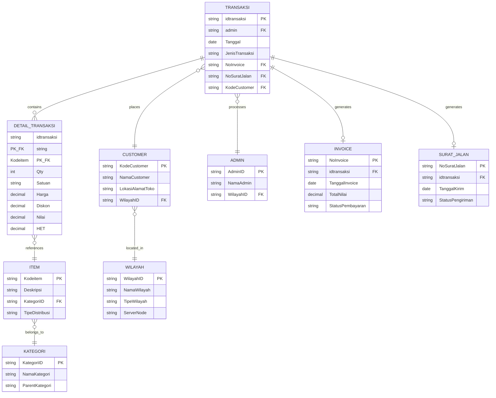
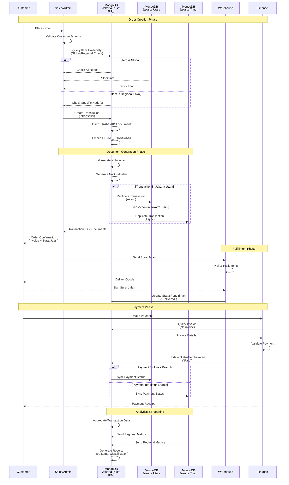

# UTS Database Management Report
## Bantex Transaction Analysis with MongoDB Distributed Architecture

---

## Executive Summary

This report presents a comprehensive analysis of Bantex transaction data (2007-2024) using MongoDB distributed database architecture across three strategic locations in Jakarta. The analysis focuses on the order-to-cash (O2C) cycle and implements a global vs local item mechanism to optimize inventory distribution.

### Business Context

**Company Overview:**
- **Organization:** PT. Bantex (Stationery and Art Supplies Distributor)
- **Database System:** MongoDB (NoSQL, Document-oriented)
- **Analysis Period:** 2007-2024 (18 years of transaction data)

**Distributed Architecture:**
- **HQ (Pusat):** Jakarta Pusat - Main headquarters and primary data center
- **Branch 1 (Cabang):** Jakarta Utara - Northern distribution center
- **Branch 2 (Cabang):** Jakarta Timur - Eastern distribution center

**Key Business Objectives:**
1. Identify top-performing items per location for optimized inventory management
2. Classify items as Global, Regional, or Lokal based on distribution patterns
3. Support data-driven decision making for multi-location inventory allocation
4. Leverage MongoDB's distributed architecture for scalable transaction processing

**Order-to-Cash Cycle:**
The O2C cycle encompasses the entire process from customer order placement to payment collection, including order processing, invoice generation, delivery (surat jalan), and payment reconciliation. This analysis provides insights into product performance across different stages of the O2C cycle.

---

## Top 5 Items Per Region

The following tables present the top 5 best-performing items in each strategic location, ranked by unique transaction count. This metric indicates customer engagement and product popularity.

**Data Source:** `Hasil/top5_item_per_wilayah.csv`

### Jakarta Pusat (HQ - Headquarters)

Jakarta Pusat serves as the headquarters and demonstrates strong performance in educational art supplies, particularly Giotto school paint products.

| Rank | Kode Item | Deskripsi | Transaksi (unik) | Qty Total | Harga (first) | Nilai Total |
|------|-----------|-----------|------------------|-----------|---------------|-------------|
| 1 | 535502 | GIOTTO SCHOOL PAINT 1000 ML, PRIM. YELLOW | 492 | 1,605 | Rp 68,400.00 | Rp 296,278,452.00 |
| 2 | 530802 | GIOTTO SCHOOLPAINT 250 ml., P. YELLOW | 476 | 1,830 | Rp 31,700.00 | Rp 152,468,600.00 |
| 3 | 530808 | GIOTTO SCHOOLPAINT 250 ml., SCARLET RED | 440 | 1,737 | Rp 31,700.00 | Rp 145,520,340.00 |
| 4 | 530815 | GIOTTO SCHOOLPAINT 250 ml., CYAN | 400 | 1,554 | Rp 31,700.00 | Rp 127,714,120.00 |
| 5 | 535508 | GIOTTO SCHOOL PAINT 1000 ML, SCARLET RED | 388 | 1,701 | Rp 68,400.00 | Rp 315,385,532.00 |

**Key Insights:**
- Strong demand for Giotto school paint products (both 1000ml and 250ml formats)
- Primary Yellow is the top performer with 492 unique transactions
- Total value concentration in premium 1000ml products
- Consistent demand across multiple color variants

### Jakarta Utara (Branch - Northern Region)

Jakarta Utara branch shows diverse product demand including modeling materials and art paper.

| Rank | Kode Item | Deskripsi | Transaksi (unik) | Qty Total | Harga (first) | Nilai Total |
|------|-----------|-----------|------------------|-----------|---------------|-------------|
| 1 | 535505 | GIOTTO SCHOOL PAINT 1000 ML, ORANGE | 192 | 650 | Rp 68,400.00 | Rp 119,788,164.00 |
| 2 | 8060001 | 806001 LYRA MODELLING CLAY 500GR WHITE | 192 | 2,192 | Rp 29,200.00 | Rp 151,383,140.00 |
| 3 | 535502 | GIOTTO SCHOOL PAINT 1000 ML, PRIM. YELLOW | 180 | 2,978 | Rp 68,400.00 | Rp 544,719,240.00 |
| 4 | 200807320 | CANSON MONTVAL 12S A3 CP 300G | 168 | 774 | Rp 81,600.00 | Rp 166,243,440.00 |
| 5 | 535508 | GIOTTO SCHOOL PAINT 1000 ML, SCARLET RED | 156 | 3,950 | Rp 68,400.00 | Rp 723,823,860.00 |

**Key Insights:**
- Balanced mix of paint and modeling clay products
- High volume quantities, especially for item 535508 (3,950 units)
- Premium art paper (Canson) shows strong presence
- Modeling clay (Lyra) demonstrates consistent regional demand

### Jakarta Timur (Branch - Eastern Region)

Jakarta Timur branch excels in modeling materials and watercolor products.

| Rank | Kode Item | Deskripsi | Transaksi (unik) | Qty Total | Harga (first) | Nilai Total |
|------|-----------|-----------|------------------|-----------|---------------|-------------|
| 1 | 387500 | DAS MODELLING MATERIALS, WHITE 1000G | 412 | 4,162 | Rp 42,600.00 | Rp 464,972,680.00 |
| 2 | 530600 | GIOTTO DECOR ACRYLIC 25ML, 12 PCS | 404 | 1,848 | Rp 85,000.00 | Rp 420,470,688.00 |
| 3 | 352700 | GIOTTO MINI WATERCOLOR 36COL 23mm | 404 | 3,425 | Rp 53,000.00 | Rp 503,337,208.00 |
| 4 | 8060007 | 806007 LYRA MODELLING CLAY 500GR YELLOW | 268 | 1,144 | Rp 29,200.00 | Rp 77,336,120.00 |
| 5 | 8060001 | 806001 LYRA MODELLING CLAY 500GR WHITE | 264 | 2,644 | Rp 29,200.00 | Rp 177,897,880.00 |

**Key Insights:**
- Leading region for DAS modeling materials (412 unique transactions)
- Strong performance in watercolor and acrylic paint sets
- High volume quantities indicate bulk institutional orders
- Diverse product portfolio across modeling and painting categories

---

## Item Classification: Global, Regional, and Lokal

Items are classified based on their presence across different regions and distribution patterns. This classification supports inventory optimization and distribution strategy.

**Data Source:** `Hasil/classifikasi_item_global_lokal.csv`

**Classification Criteria:**
- **Global:** Items present in all 5 regions (Jakarta Pusat, Utara, Timur, Barat, Selatan)
- **Regional:** Items present in 2-4 regions
- **Lokal:** Items present in only 1 region

**Classification Summary:**
- **Global Items:** 15 items (0.8%)
- **Regional Items:** 761 items (41.7%)
- **Lokal Items:** 1,048 items (57.5%)

### Top Global Items (Present in All Regions)

| Kode Item | Deskripsi | Presence Count | H_norm | Max Share | Wilayah Dominan | Label |
|-----------|-----------|----------------|--------|-----------|-----------------|-------|
| 1870101 | LYRA GROOVE GRAPHITE PENCIL B | 5 | 0.7278 | 0.5909 | Jakarta Pusat | Global |
| 351200 | GIOTTO WATERCOLOR BLOCKS 30MM 12 COLS | 5 | 0.7929 | 0.5091 | Jakarta Pusat | Global |
| 352300 | GIOTTO MINI WATERCOLOR 12COL 23mm | 5 | 0.9108 | 0.3241 | Jakarta Pusat, Jakarta Utara | Global |
| 352400 | GIOTTO WATERCOLOR BLOCKS 30MM 24 COLS | 5 | 0.7349 | 0.5957 | Jakarta Timur | Global |
| 352600 | GIOTTO MINI WATERCOLOR 24COL 23mm | 5 | 0.9196 | 0.3699 | Jakarta Timur | Global |
| 387000 | DAS MODELLING MATERIALS, WHITE 500G | 5 | 0.7485 | 0.4286 | Jakarta Pusat | Global |
| 530801 | GIOTTO SCHOOLPAINT 250 ml., WHITE | 5 | 0.6815 | 0.6403 | Jakarta Pusat | Global |
| 530802 | GIOTTO SCHOOLPAINT 250 ml., P. YELLOW | 5 | 0.6471 | 0.6761 | Jakarta Pusat | Global |
| 530808 | GIOTTO SCHOOLPAINT 250 ml., SCARLET RED | 5 | 0.6434 | 0.6832 | Jakarta Pusat | Global |
| 530812 | GIOTTO SCHOOLPAINT 250 ml., GREEN | 5 | 0.6811 | 0.6439 | Jakarta Pusat | Global |

**Metrics Explanation:**
- **Presence Count:** Number of regions where item appears
- **H_norm:** Normalized entropy (0-1), higher values indicate more balanced distribution
- **Max Share:** Proportion of transactions in dominant region
- **Wilayah Dominan:** Region(s) with highest transaction volume

**Strategic Implications:**
1. **Global items** should be stocked in all warehouses with centralized replenishment
2. **Regional items** require selective distribution based on demand patterns
3. **Lokal items** need location-specific inventory management

---

## Entity Relationship Diagram (ERD)

### Conceptual Schema (3NF - Third Normal Form)

### Entity and Attribute Details (3NF Mapping)

| Entity | Key Attributes | Description | MongoDB Collection |
|--------|----------------|-------------|-------------------|
| **TRANSAKSI** | idtransaksi (PK), admin (FK), KodeCustomer (FK) | Core transaction header with order metadata | transactions |
| **DETAIL_TRANSAKSI** | idtransaksi (PK, FK), Kodeitem (PK, FK) | Line items with quantity, price, and discount | transaction_details (embedded) |
| **CUSTOMER** | KodeCustomer (PK), WilayahID (FK) | Customer master data with location | customers |
| **ITEM** | Kodeitem (PK), KategoriID (FK) | Product master with classification | items |
| **KATEGORI** | KategoriID (PK) | Product category hierarchy | categories |
| **WILAYAH** | WilayahID (PK), ServerNode | Geographic region with MongoDB node mapping | regions |
| **ADMIN** | AdminID (PK), WilayahID (FK) | System users processing transactions | admins |
| **INVOICE** | NoInvoice (PK), idtransaksi (FK) | Billing documents | invoices |
| **SURAT_JALAN** | NoSuratJalan (PK), idtransaksi (FK) | Delivery notes | delivery_notes |

**Normalization Notes:**
- All entities follow 3NF: no transitive dependencies, all non-key attributes depend solely on primary key
- MongoDB implementation uses embedded documents for DETAIL_TRANSAKSI within TRANSAKSI for performance
- Referencing used for master data (CUSTOMER, ITEM, WILAYAH) to avoid data duplication

**MongoDB Distributed Design:**
- **Sharding Key:** `WilayahID` - enables geographic data distribution
- **Jakarta Pusat Node:** Primary shard for HQ transactions and global metadata
- **Jakarta Utara Node:** Replica with local shard for northern region
- **Jakarta Timur Node:** Replica with local shard for eastern region

---

## Order-to-Cash Process Flow

The following sequence diagram illustrates the complete order-to-cash cycle in the distributed MongoDB environment.

**Process Stages:**

1. **Order Creation (O2C Start)**
   - Customer places order through sales admin
   - System checks item availability across distributed nodes
   - Global items checked across all nodes; Regional/Lokal items checked in specific nodes

2. **Document Generation**
   - Transaction record created with unique `idtransaksi`
   - Invoice (`NoInvoice`) and Delivery Note (`NoSuratJalan`) generated
   - Data replicated to relevant regional MongoDB nodes

3. **Fulfillment**
   - Warehouse receives Surat Jalan
   - Items picked, packed, and delivered to customer
   - Delivery status updated in database

4. **Payment Collection (O2C End)**
   - Customer makes payment against invoice
   - Finance validates and records payment
   - Payment status synchronized across distributed nodes

5. **Analytics & Reporting**
   - Transaction data aggregated from all nodes
   - Top items and classification reports generated
   - Business intelligence for inventory optimization

---

## Appendix: Other Regions

### Jakarta Barat

| Rank | Kode Item | Deskripsi | Transaksi (unik) | Qty Total | Harga (first) | Nilai Total |
|------|-----------|-----------|------------------|-----------|---------------|-------------|
| 1 | 530815 | GIOTTO SCHOOLPAINT 250 ml., CYAN | 52 | 326 | Rp 31,700.00 | Rp 28,994,000.00 |
| 2 | 535502 | GIOTTO SCHOOL PAINT 1000 ML, PRIM. YELLOW | 52 | 114 | Rp 72,900.00 | Rp 23,280,600.00 |
| 3 | 530802 | GIOTTO SCHOOLPAINT 250 ml., P. YELLOW | 48 | 529 | Rp 31,700.00 | Rp 46,954,040.00 |
| 4 | 530808 | GIOTTO SCHOOLPAINT 250 ml., SCARLET RED | 48 | 417 | Rp 31,700.00 | Rp 37,138,360.00 |
| 5 | 535508 | GIOTTO SCHOOL PAINT 1000 ML, SCARLET RED | 48 | 127 | Rp 72,900.00 | Rp 25,973,100.00 |

### Jakarta Selatan

| Rank | Kode Item | Deskripsi | Transaksi (unik) | Qty Total | Harga (first) | Nilai Total |
|------|-----------|-----------|------------------|-----------|---------------|-------------|
| 1 | 535502 | GIOTTO SCHOOL PAINT 1000 ML, PRIM. YELLOW | 216 | 688 | Rp 68,400.00 | Rp 130,022,272.00 |
| 2 | 535508 | GIOTTO SCHOOL PAINT 1000 ML, SCARLET RED | 208 | 1,041 | Rp 68,400.00 | Rp 236,934,996.00 |
| 3 | 530808 | GIOTTO SCHOOLPAINT 250 ml., SCARLET RED | 180 | 1,068 | Rp 31,700.00 | Rp 90,001,560.00 |
| 4 | 530815 | GIOTTO SCHOOLPAINT 250 ml., CYAN | 176 | 1,108 | Rp 31,700.00 | Rp 93,331,360.00 |
| 5 | 530802 | GIOTTO SCHOOLPAINT 250 ml., P. YELLOW | 168 | 1,086 | Rp 31,700.00 | Rp 91,666,920.00 |

**Note:** Jakarta Barat shows limited transaction volume, while Jakarta Selatan demonstrates strong performance similar to the main branches. Kepulauan Seribu is not represented in this dataset, indicating potential market expansion opportunity.

---

## Conclusions and Recommendations

### Key Findings

1. **Product Performance:**
   - Giotto school paint products dominate across all regions
   - Different regions show preferences for different product categories (HQ: paints, Timur: modeling, Utara: mixed)
   - Global items (15 products) represent core inventory that should be available across all locations

2. **Regional Characteristics:**
   - Jakarta Pusat (HQ): Highest diversity (1,145 unique items), strong in premium paints
   - Jakarta Timur: Specializes in modeling materials and bulk orders
   - Jakarta Utara: Balanced portfolio with emphasis on modeling clay
   - Jakarta Barat & Selatan: Smaller markets with focused product ranges

3. **Distribution Strategy:**
   - 57.5% of items are location-specific (Lokal), requiring tailored inventory
   - 41.7% are Regional items, benefiting from shared distribution
   - Only 0.8% are truly Global, suitable for centralized inventory management

### Recommendations

1. **Inventory Optimization:**
   - Maintain centralized stock of 15 Global items at Jakarta Pusat HQ
   - Implement regional warehousing for 761 Regional items
   - Allow local procurement flexibility for 1,048 Lokal items

2. **MongoDB Architecture:**
   - Continue geographic sharding by `WilayahID` for optimal query performance
   - Implement read replicas in each branch for local reporting
   - Use write concern majority for financial transactions

3. **Business Intelligence:**
   - Establish automated reporting pipeline using the CSV generation scripts
   - Monitor item classification changes quarterly for emerging trends
   - Implement predictive analytics for seasonal demand variations

4. **Market Expansion:**
   - Investigate Kepulauan Seribu market potential (currently no data)
   - Strengthen Jakarta Barat presence (only 32 unique items)
   - Consider sub-regional distribution centers for high-volume areas

---

## Technical Notes

**Data Processing:**
- Scripts located in `scripts/` directory
- Primary script: `scripts/process_data.py`
- Generated outputs: `Hasil/top5_item_per_wilayah.csv`, `Hasil/classifikasi_item_global_lokal.csv`

**Methodology:**
- Top items ranked by unique transaction count (not by revenue or quantity)
- Classification based on regional presence and distribution entropy (H_norm)
- Analysis covers full dataset: 2007-2024 transaction history

**MongoDB Considerations:**
- Document model optimizes for O2C workflow
- Embedded DETAIL_TRANSAKSI reduces join operations
- Sharding strategy supports horizontal scaling
- Geographic distribution improves query latency for regional operations

---

*Report Generated: 2024*  
*Data Period: 2007-2024*  
*Database System: MongoDB Distributed Architecture*  
*Analysis Framework: Global vs Regional vs Lokal Item Classification*
